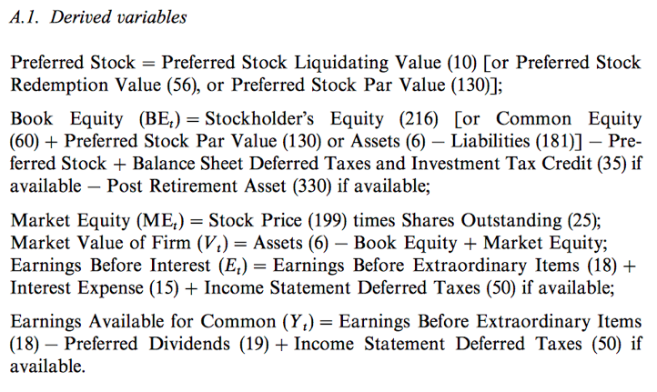
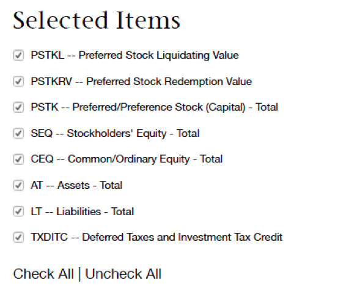
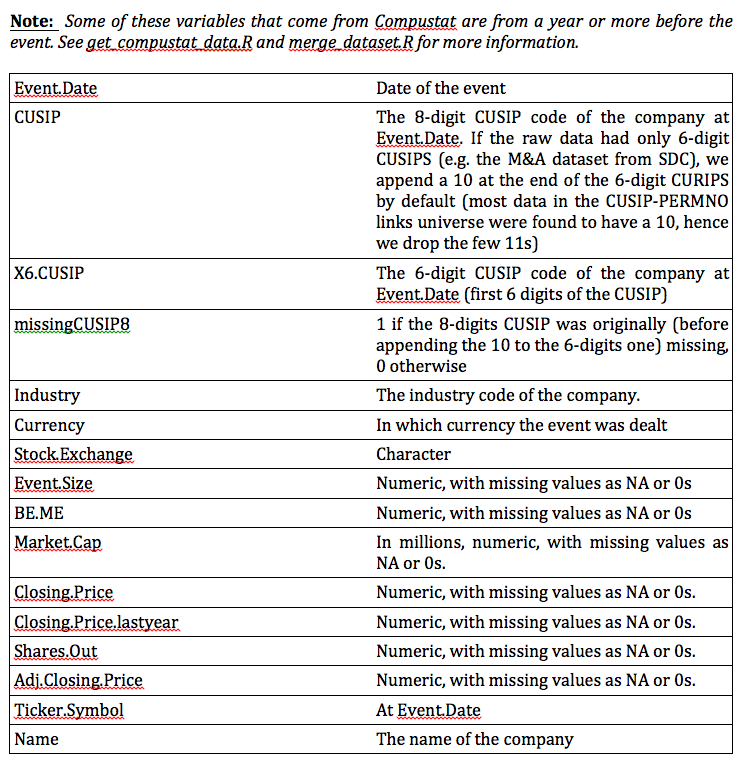
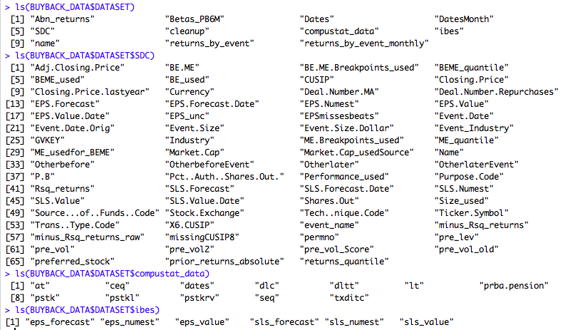
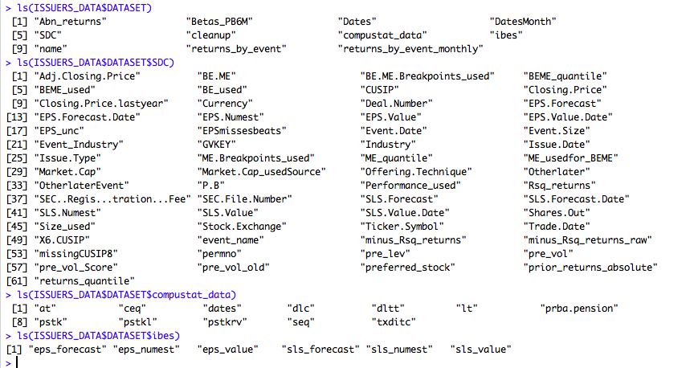

 

**Share Buyback and Equity Issue Anomalies Revisited: Dataset Creation**

 

The datasets can be generated using the raw data from the following databases:

-	S&P500 daily and monthly returns from CRSP
-	The FF factors and breakpoints from the FF website
-	Event data from SDC
-	Daily closing prices, and returns as well as monthly returns, prices, and shares outstanding (to get the market capitalizations) from CRSP
-	All necessary data to calculate the BE/ME ratios of the firms from Compustat (see below) 
-	Quarterly EPS and Sale consensus forecasts and actual values from IBES 

Note: when downloading data from the databases (e.g. from SDC), the variables’ names in the .csv files may change. The only changes in the code that may be needed to handle such changes are in x/standardize_data.R and any files used in that code. Moreover, the data period can change as needed. 

In this document x notes the event data considered (e.g. buybacks, issuers, or possibly IPOs etc). The steps below are also followed in process_code/create_dataset.R. The final data for each event dataset “x” are saved in dataset/x.Rdata. 

**Step 1: Get the S&P daily and monthly returns data from CRSP**

Download the S&P monthly and daily returns from CRSP, as described in the query files *Documentation/CRSP Stock Market Indexes Monthly.pdf* and *Documentation/CRSP Stock Market Indexes Daily.pdf*. Save the data as *snp500_monthly.csv* and *snp500.csv* in the directory *indices_and_factors*. 

**Step 1b: Get the CRSP universe data used to compute percentiles for various firm characteristics**

Download the daily and monthly returns of the all firms in CRSP during the period, as described in the query files *Documentation/CRSP_universe_returns.pdf and *Documentation/ CRSP_universe_returns_monthly.pdf. 

**Step 2: Get the Fama-French factors and breakpoints data**

We need both the Fama-French factors as well as the Size and B/P breakpoints. These can be found at FF’s website. We get the following files from that website (saved in the indices_and_factors directory):

-	Fama/French 5 Factors (2x3)
-	Fama/French 5 Factors (2x3) [Daily] (we typically don’t use daily)
-	ME Breakpoints
-	BE/ME Breakpoints

Delete any extra lines at the beginning and at the end of these downloaded csv files. Note that the FF data are available since 1963, hence they cover all reasonable periods.  

Once the S&P ad FF csv files are saved, source the file *get_ff_and_market_data.R* (see file for the exact names of datafiles expected). This will format and combine all S&P and FF data and save them in *dataset/indices_and_factors/market_ff_data.Rdata* which will be used throughout the process. 

**Step 3:  Get the Event Data from SDC**
 

Both buybacks and issuers event data come from SDC.  Download the event data from SDC Platinum as described in the powerpoint files in 

-	*Documentation/SDC Documentation/sdc_x_screenshots.pptx*. 

The SDC session and report files used can also be found in the *Documentation/SDC Documentation/* directory. The data need to be saved in x/sdc/sdc_output_x.csv*.  Note: SDC outputs .xls files. When saving them as .csv, make sure to delete the first row of the .xls that says Source: Thomson Reuters   Date: … 

 

**Step 3b:** Buybacks .csv creation from SDC

Buyback events come from 2 different SDC databases, as indicated in the corresponding .pptx screenshots: the Repurchases and the US Targets, both in the Mergers & Acquisitions database of SDC.  Hence, we manually get from SDC two .csv files for buybacks:

-	*buybacks/sdc/sdc_output_buybacks_repurchases.csv*
-	*buybacks/sdc/sdc_output_buybacks_ma.csv*. 

These two files are combined into one file called *buybacks/sdc/sdc_output_buybacks.csv* by *buybacks/sdc/buybacks_rawdata_combine.R*. The latter is sourced within *buybacks/standardise_data.R*, which is called in *process_code/create_dataset.R*. This .csv file combines all features available across the 2 buybacks event data from SDC, leaving missing values as 0s or NA.  

 

**Step 3c**: Standardize the event datasets

File x/standardize_data.R removes any events for which there is a missing CUSIP or Event Date, renames a number of variables into standard names across event datasets (see Appendix A), and handles duplicate events, defined as those that have the same CUSIP and Event Date. See x/standardize_data.R in each event directory for more details on how duplicates are handled for that event. 

 
 
 
 
**Step 4: Get the daily and monthly data from CRSP**

This step requires a combination of R, python, and manual data download from CRSP. The R and python codes used are in *process_code/get_crsp_data.R*

 

**Step 4a: Get the SDC CUSIPs – CRSP PERMNOs Links from CRSP**

First get all cusip-permno pairs in the whole time period, using the CRSP query in 
*Documentation/CRSP_CUSIP_PERMNO.pdf*  (we need the daily data, as events can happen any day of the month), and save in crsp_permno_cusip_pairs/crsp_permno_cusip_pairs.csv. 

Note: this data can be used for any data (not only issuers and buybacks) as it covers the whole universe of stocks in the period (e.g. 1980-2014). 

Now run the code in process_code/get_crsp_data.R, including the manual python described there. All this does is to create the following two .csv files:

-	*tmp_files/crsp_sdc_link_x.csv*
-	*x/returns/permno_for_crsp_x.csv* 

The first file matches the CUSIP-Date pairs from the SDC event data with the CRSP PERMNOS using the *crsp_permno_cusip_pairs/crsp_permno_cusip_pairs.csv* data created above. It is used to append the CRSP PERMNO to the SDC data. The second file is used below to get the data from CRSP using the PERMNOS. When running python one can also see how many CUSIP-Date pairs were not found (as reported in the .Rnw and the paper).

Note: some events data only have 6-digits CUSIP (e.g. the buybacks events from the M&A database in SDC). We have the following options: 

-	Option 1: append a 10 at the end of the 6-digits CUSIPs hence creating 8-digit ones. See also the [official CUSIP documentation.](https://www.cusip.com/pdf/CUSIP_Intro_03.14.11.pdf)
-	Option 2: Use the 6-digit CUSIPs whenever the 8-digits one is not available, else use the 8-digits ones, and remove any CRSP data that are duplicate matches (e.g. one 6-digit CUSIP matching multiple 8-digits ones);
-	Option 3: we use only the first 6-digits of all the CUSIPs and again remove any CRSP data that are duplicate matches (e.g. one 6-digit CUSIP matching multiple 8-digits ones);
-	Option 4: Do the same as option (2), but for the available 8-digits CUSIPS we remove all those that do not end in a 10 or 11.

Based on tests done using the code described in *process_code/get_crsp_data.R* and *process_code/cusip6vs8tests.py*, as well as because IBES later (Step 5) needs 8-digits CUSIPs, we follow Option 1. The difference between the various options is minimal. Details are provided in the .Rnw (the paper).  

 

**Step 4b: Get the daily and monthly data from CRSP**

Get the CRSP daily and monthly data (adjusted returns, closing prices, shares outstanding) from CRSP by using the CRSP queries described in *Documentation/CRSPreturns_daily.pdf*  (for daily) and *Documentation/CRSPreturns_monthly.pdf* (for monthly) and uploading to CRSP the permnos from file x/returns/permno_for_crsp_x.csv created above. Save the downloaded CRSP datasets in:

-	*x/returns/crsp_returns.csv*, for the daily data
-	*x/returns/crsp_returns_monthly.csv*, for the monthly data

**Step 5: Get the BE related, ME related, and other data from Compustat**

We use Compustat to get the annual BE/ME ratios of the firm as described in Appendix 1 of 
[Disappearing dividends: changing firm characteristics or lower propensity to pay?, Fama-French, JFE 2001](http://www.ulb.ac.be/cours/solvay/farber/Ofin/Reading%206%20Disappearing%20dividend.pdf):
 
The Preferred Stock and Book Equity equation variables (except the Post Retirement Asset which we get from the *Compustat Monthly Updates - Pension Annual Database*) correspond to the following variables in the CRSP/Compustat Merged - Fundamentals Annual database, in the same order as they appear in the equation: 

The Preferred Stock and Book Equity equation variables (except the Post Retirement Asset which we get from the Compustat Monthly Updates - Pension Annual Database) correspond to the following variables in the CRSP/Compustat Merged - Fundamentals Annual database, in the same order as they appear in the equation: 

 
 
We use two databases in this step:

-	*CRSP/Compustat Merged - Fundamentals Annual* (under CRSP in WRDS)
-	*Compustat Monthly Updates - Pension Annual* (under Compustat in WRDS) 

In this step we also find the appropriate BE/ME and ME thresholds that will then be used in merge_dataset.R to find the BE/ME and ME quantiles. The FF beakpoints require that we use the appropriately lagged BE/ME and Market Capitalization (ME) of the firms (see also Appendix).

 

**Step 5a:** First get the *CRSP PERMNO/Compustat GVKEY links* from the *CRSP/Compustat Merged* database using the CRSP/Compustat Merged query described in *Documentation/ CRSP/ LINK CRSP COMPUSTAT.pdf*. Save this data in 
*crsp_compustat_gvkey_pairs/crsp_compustat_gvkey_pairs.csv*

Note that this data can be used for any data (not only issuers and buybacks) as it covers the whole universe of stocks in the period (e.g. 1980-2014). 

 

**Step 5b:** Run the first part of *get_compustat_data.R*  (see code) to generate this file:

-	*x/compustat/gvkeys_for_compustat_x.csv*

This is a file of all the GVKEYs of the events we found through matching PERMNOs with GVKEYs using *crsp_compustat_gvkey_pairs/crsp_compustat_gvkey_pairs.csv*. It also appends the GVKEYs to the SDC data (so at this stage the SDC data have both PERMNOs and GVKEYs). It also removes all rows for which the assets (AT) or the revenues (REVT) of the firm that year were missing (NAs) or <= 0; all cases for which the “LINKPRIM” was “J” or “N” (see [CRSP documentation here](http://www.crsp.com/files/ccm_data_guide_0.pdf)); and all cases corresponding to PERMNOs that are linked to multiple GVKEYs. 

 
**Step 5c:** Get the data from CRSP/Compustat Merged - Fundamentals Annual by uploading to this WRDS database the *x/compustat/gvkeys_for_compustat_x.csv* file and using the CRSP/Compustat Merged query described in *Documentation/ CRSP/Compustat Merged - Fundamentals Annual.pdf*. Save this data in:

*x/compustat/compustat_fundamental_annual .csv*

 

**Step 5d:** Get the data from Compustat Monthly Updates - Pension Annual by uploading to this WRDS database the *x/compustat/gvkeys_for_compustat_x.csv* file and using the Compustat query described in the Compustat query file *Documentation/Compustat Monthly Updates - Pension Annual.pdf*.  Save this data in:

*x/compustat/compustat_pension_annual .csv*

Note: As indicated in the Compustat queries pdf files, we get data from Compustat for more than 6 years before the first event from SDC, so we can get the BE/ME for them from the very beginning. 

 

**Step 5e:** Run the second part of *get_compustat_data.R*  (see code) to merge the Compustat data with the existing SDC data so far. The new SDC data with the added Compustat data will be saved again in file dataset/x.Rdata. 
Note: We will deal with the cases where BE < 0 in Step 7 (in *merge_dataset.R*), following the steps described at Ivo Welch’s website – see also Appendix.

 

**Step 6: Get x/ibes/ibes_x.csv from IBES**

File *x/ibes/cusip_for_ibes.csv* is generated in *create_dataset.R* and it has all 8-digit CUSIPs from SDC (as noted in Step 2 above, we appended 10 at the of 6-digits CUSIPS). Use this .csv file to get the IBES data from IBES (SUMMARY HISTORY -> SUMMARY STATISTICS) as described in *Documentation/IBES.pdf*. Get the data in .csv format, both EPS and SLS in one file, saved at *x/ibes/ibes_all.csv*. This file will be used next in Step 7 by *merge_data.R* to merge all data. 

Note: make sure the data in *x/ibes/cusip_for_ibes.csv* do not have any special characters (e.g. + due to general format), as IBES may then exit.

**Step 7: Merge all SDC, CRSP, Compustat and IBES data**

We now merge the CRSP and IBES data into the SDC data (which already has the Compustat information – see above) using *process_code/merge_dataset.R*. See that file to confirm that all necessary .csv and .Rdata files are generated before that file is sourced. Events for which no CRSP return data were found are removed at this stage (see paper for details). 

**Step 8:  “Light Scrubbing” of the data**

Data scrubbing (e.g. remove further missing values etc, as described in the paper) is done by first *scrub_dataset.R*. This is a “light” data scrubing, removing only any remaining problematic data (see code), in addition to the events removed in *x/standardize_data.R* (see above) and in  *process_code/merge_dataset.R* (see above). The output is the final data that is used by the .Rnw file. 

The final data saved in *dataset/x.Rdata*
	

**Running the report code**

The data generated above is then used by the .Rnw to generate the paper (.pdf file). Part of the analysis may require that further data is removed based on possible new filters.  All these “filters” used for the final paper are included in *load_data.R*, *business_data_clean.R* and *report_data.R*. Moreover, the parameters used by the data filters are in *Paper_global_parameters.R*. Notice that load_data.R also date-aligns all market, Fama-French, and stock returns that are then used throughout the .Rnw.

All analyses in the paper are finally done based on the data coming out of *bb_issuers.R* and any code in the .Rnw of the paper. 

**Appendix A: Event Data Names Standardization**

The variable names of the event data (e.g. from SDC) are standardized in x/standardize_data.R so that the code afterwards treats all event data the same. 

All standardise_data.R files in the respective datasets' directories need to output these features, plus any other that may be dataset specific (with names exactly like those from SDC so that we can easily find their meaning). We assume all these have NA or 0 for missing values.

**THESE ARE THE STANDARDIZED FEATURES ALL EVENTS DATASETS NEED TO HAVE BEFORE** *process_code/get_crsp_data.R* in *create_dataset.R*:

Note:  Some of these variables that come from Compustat are from a year or more before the event. See *get_compustat_data.R* and *merge_dataset.R* for more information.

At the end we have the following variables (for buybacks and issuers):

**Appendix: FF Breakpoints, ME and BE/ME calculations**

File *get_compustat_data.R* and *merge_dataset.R* also calculate the BE, ME, BE/ME, and the 5-quantile features of the companies based on the FF breakpoints from the FF website. FF note that:

-	"We compute BE/ME breakpoints at the end of each June. The BE used in June of year t is the book equity for the last fiscal year end in t-1. ME is price times shares outstanding at the end of December of t-1."    
-	"We compute ME breakpoints for each month. ME is price times shares outstanding (divided by 1,000,000) at month end.”
-	“The (ME) breakpoints for month t use all NYSE stocks that have a CRSP share code of 10 or 11 and have good shares and price data. We exclude closed end funds and REITs.”

Based on these, we do the following:

For BE/ME breakpoints: 

We always get the ME/BE breakpoints of the first June before the date of the event – this can be the same or the previous year’s June, depending on whether the date of the event is before/in (hence we get the previous year) or after (hence we get the same year) June.

For BE: 

-	If the date of the event is after June, we get the first available BE before the first December before the event (hence in the whole previous year). This is because we compare in this case with the BE/ME breakpoint of the June in the current year. 
-	If the date of the event is before/in June, we get the first available BE before the second December before the date of the event (hence in the year two years before). This is because we compare in this case with the BE/ME breakpoint of the June in the previous year. Note: we consider for now December as the fiscal year end. Since BE does not change fast, this is a reasonable approximation to simplify the code. However, this will be fixed/refined. 

For the ME used in the BE/ME calculation: 

We do as for the BE, but we use only December ME values of the years selected. ME is the product of CRSP monthly (December) price times CRSP monthly shares outstanding, divided by 1000 (as shares outstanding are in 1000s). 

For ME breakpoints and corresponding ME of the companies: 

We get the ME breakpoints and companies’ ME the month before the date of the event – we have these monthly.

Dealing with negative BEs values: 

BE values are sometimes negative (see also Ivo Welch’s website) We deal with them as suggested in that website (see merge_dataset.R):

-	First we set to NA those cases for which the debt (Compustat dlc_dltt) is negative;
-	For the remaining cases, we set BE to the max(0, (1/100)*(dlc+dltt), (0.1/100)*at)

**Appendix C: Other data to consider**

-	[Ivo Welch Website](http://www.ivo-welch.info/professional/leverage.placebo/)

